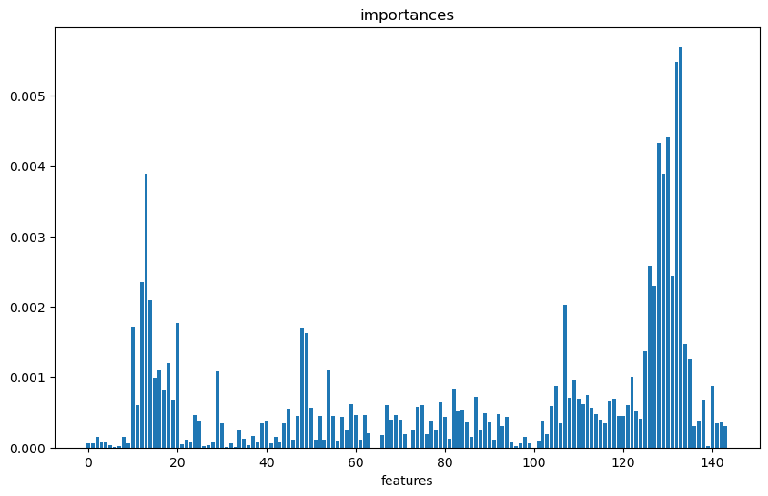

# Профильное задание
## Инженер машинного обучения

Дан датасет [**_intern_task.csv_**](https://drive.google.com/file/d/1viFKqtYTtTiP9_EdBXVpCmWbNmxDiXWG/view?usp=sharing) для ранжирования. Он содержит: 
* **query_id** — айди поисковой сессии
* признаки релевантности документа запросу
* **rank** — оценка релевантности.

Необходимо:
* подготовить и проверить датасет

* натренировать на любом удобном фреймворке модель, которая будет ранжировать документы по их признакам внутри одной сессии (**query_id**) 

* посчитать метрики ранжирования модели (ndcg_5 как минимум)
    
* оформить решение на github.

## Решение
Полный пайплайн решения находится в файле [**_main.py_**](https://github.com/MyDum-bsu/internship_vk_ml_2024/blob/main/main.py). 
Для решения задачи использовался Catboost.

### install

    $ pip install numpy pandas scikit-learn catboost

### quick start
Чтобы начать обучение выбранной модели запустите файл

    $ python main.py 

### parameters

Файл можно запускать с множеством флагов

    --input-file        файл датасета
    --work-dir          файл сохранения обучения
    --out-file          файл модели
    --resume            флаг использования существующей модели
    --train-size        процентный размер обучающей выборки
    --max-steps         число итераций
    --device            устройство: CPU или GPU
    --seed              установить начальный сид
    --top-k             параметр для метрик
    --loss              функция потерь
    --weight            флаг использования взвешенных queiry
    --learning-rate     размер шага
    --verbose           логгирование
Если у вас есть сохраненная модель, её можно запустить, указав каталог

    $ python main.py --out-file=pair-logit

В результате применения моделей получим следующие графики


 В файле [**_utils.ipynb_**](https://github.com/MyDum-bsu/internship_vk_ml_2024/blob/main/utils.ipynb)
 
 * написаны предобработка данных, анализ на пропущенные значения, подсчет статистик
 
 * Параметры моделей по умолчанию 

```py

    default_parameters = {
    'iterations': 4000,

    'custom_metric': ['NDCG:top=5', 'PFound',
                      'AverageGain:top=10', 'MAP:top=5',
                      'RecallAt:top=10', 'PrecisionAt:top=10'],
    'verbose': 500,
    'random_seed': 0,
    }
```
В качестве функции потерь использовались `RMSE`, `PairLogit`, `PairLogitPairwise`, `YetiRankPairwise`. В результате эксперимента наилучший результат показала модель с функцией потерь `PairLogit`.

<summary>NDCG@5 score</summary>

| Model | NDCG@5 |
|------:|----------|
|     RMSE| 0.9015961918657435                      |
|     Weight+RMSE| 0.9671987306219144               |
|     QueryRMSE| 0.9015961918657435                 |
|     PairLogit| 0.9999999999999999                 |
|     PairLogitPairwise| 0.6791738589179246         |
|     YetiRankPairwise| 0.7456298460447878          |
|     YetiRankPairwise, lr=0.3| 0.7739077626929334  |


Помимо этого было произведено иследование на важность признаков, были отобраны признаки следующим образом:


```py
imp = model.get_feature_importance(data=train)
X_train_filtered = X_train.loc[:, np.quantile(imp, 0.5) <= imp]
X_test_filtered = X_test.loc[:, np.quantile(imp, 0.5) <= imp]
```


В результате обучения модели с функцией потерь `YetiRank` на `4000` итераций получилось достичь `ndcg@5=0.99`

Для обучения использовались ресурсы Google Colab. Файл [**_utils_colab.ipynb_**](https://github.com/MyDum-bsu/internship_vk_ml_2024/blob/main/utils_colab.ipynb) содержит блоки кода обучения моделей.

